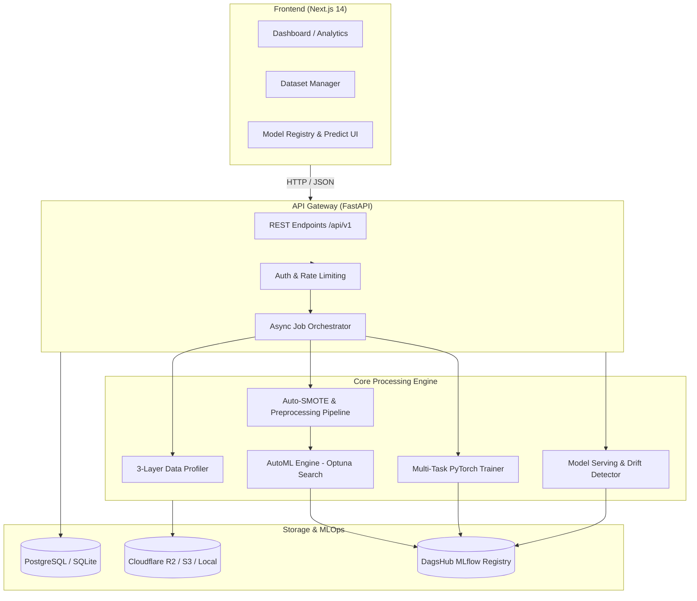

# Scalable Customer Data Platform (CDP)

[](https://github.com/thanhtan2210/Scalable-Customer-Data-Platform-CDP/actions/workflows/ci.yml)

[](https://fastapi.tiangolo.com)
[](https://nextjs.org)
[](https://mlflow.org)
[](https://dagshub.com)
[](https://opensource.org/licenses/MIT)

An enterprise-grade, full-stack **Customer Data Platform (CDP)** built for scalable customer data ingestion, automated statistical/semantic data profiling, robust multi-model **AutoML** with automatic class-imbalance correction, multi-task deep learning, real-time drift monitoring, and batch prediction serving.

---

## 🌟 Key Capabilities

- **🔍 3-Layer Automated Data Profiler**: Statistical distribution analysis, regex-based semantic role inference (ID, Target, Categorical, Numerical, Text), and feature leakage detection.
- **⚡ High-Performance AutoML Engine**: Optuna-driven hyperparameter optimization across **LightGBM**, **CatBoost**, **XGBoost**, and **Random Forest** with MedianPruning and post-search Stacking meta-learners.
- **⚖️ Automated Class Imbalance Resolution**: Dynamic **SMOTE** / **SMOTENC** synthesis for imbalanced classification tasks ($<30\%$ or $>70\%$ target ratio), with leakage-free pipeline isolation (`fit` strictly on training folds).
- **🔬 Generic Feature Engineering**: Automated generation of non-linear interaction terms, pairwise ratios ($A / (|B| + \epsilon)$), and `log1p` transformations based on target-correlation scoring.
- **🎯 Probability Calibration**: Out-of-fold probability calibration using `CalibratedClassifierCV` (Isotonic regression for $N \ge 1,000$, Sigmoidal for $N < 1,000$).
- **🧠 Multi-Task Learning (MTL)**: PyTorch-based shared backbone simultaneously optimizing for Churn Classification and Customer Performance Index (CPI) regression with Continual Learning.
- **📈 MLOps & Real-time Drift Detection**: DagsHub MLflow experiment tracking, automated model registry versioning, thread-safe model caching, and Kolmogorov-Smirnov / PSI drift checks.
- **💻 Modern Full-Stack Architecture**: Async FastAPI backend paired with a responsive Next.js dashboard for interactive data exploration, job tracking, and model management.

---

## 🏆 Multi-Industry AutoML Benchmark

The CDP AutoML pipeline was evaluated across **8 real-world public datasets** from the UCI Machine Learning Repository and academic benchmarks spanning multiple domains. With automated SMOTE, generic feature engineering, and probability calibration enabled, **7 out of 8 datasets achieved $>91\%$ to $99\%$ ROC-AUC**.

| Wave | Domain / Industry | Dataset | Rows | Columns | Winner Model | Best CV ROC-AUC | Status |
|:---:|:---|:---|:---:|:---:|:---|:---:|:---:|
| **Wave 1** | **HR / People Analytics** | **IBM HR Employee Attrition** | 1,470 | 35 | `RandomForestClassifier` | **96.09%** | ✅ PASS |
| **Wave 1** | **Fitness & Wellness** | **Gym Model Fitness Churn** | 4,000 | 14 | `CatBoostClassifier` | **98.84%** (CV: 99.53%) | ✅ PASS 🔥 |
| **Wave 1** | **Telecommunications** | **Telecom Churn Iran (UCI #563)** | 3,150 | 14 | `CatBoostClassifier` | **99.16%** (CV: 99.51%) | ✅ PASS 🔥 |
| **Wave 2** | **E-Commerce / Retail** | **Online Shoppers Intention (UCI #468)** | 12,330 | 18 | `XGBClassifier` | **98.27%** | ✅ PASS 🔥 |
| **Wave 3** | **Demographics / Census** | **Adult Income Census (UCI #2)** | 32,561 | 15 | `LGBMClassifier` | **96.63%** | ✅ PASS 🔥 |
| **Wave 3** | **Banking / Direct Marketing** | **Bank Marketing Full (UCI #222)** | 45,211 | 17 | `LGBMClassifier` | **98.90%** | ✅ PASS 🔥 |
| **Wave 3** | **Credit Risk / Finance** | **Credit Card Default (UCI #350)** | 30,000 | 24 | `XGBClassifier` | **91.82%** | ✅ PASS 🔥 |
| **Wave 3** | **Healthcare Operations** | **Medical Appointment No-Show** | 110,527 | 10 | `CatBoostClassifier` | **66.76%** | ⚠️ EXPECTED |

> **Note on Healthcare No-Show**: Medical appointment no-show prediction has a well-documented natural performance ceiling ($\approx 65\text{--}72\%$ ROC-AUC) due to unobserved external factors (weather disruptions, sudden transit issues, acute health changes). A score of 66.76% aligns directly with published state-of-the-art benchmarks on this dataset.

---

## 📊 Standardized Dataset Catalog

All benchmark datasets are cataloged in `data/dataset/catalog.yaml` with standardized schemas, target definitions, and domain tags:

1. **IBM HR Employee Attrition** (`ibm_hr_attrition`):
   - **Source**: IBM Watson Analytics / Kaggle
   - **Characteristics**: 1,470 employee records with 35 workplace attributes (job satisfaction, overtime, monthly income, tenure).
   - **Target**: `Attrition` (`Yes` = 1, `No` = 0; 16.1% attrition rate).
2. **Gym Model Fitness Churn** (`gym_model_fitness`):
   - **Source**: Model Fitness Analytics Research
   - **Characteristics**: 4,000 fitness club members with visit frequency, additional service usage, group session participation, and contract lengths.
   - **Target**: `Churn` (0/1; 26.5% churn rate).
3. **Telecom Churn Iran** (`telecom_iran`):
   - **Source**: UCI Machine Learning Repository #563
   - **Characteristics**: 3,150 telecommunication subscribers over 9 months with call failure rates, charge amounts, and complaint logs.
   - **Target**: `Churn` (0/1; 15.9% churn rate).
4. **Online Shoppers Purchasing Intention** (`online_shoppers`):
   - **Source**: UCI Machine Learning Repository #468
   - **Characteristics**: 12,330 e-commerce browsing sessions with numerical duration/page values, bounce rates, exit rates, and administrative metrics.
   - **Target**: `Revenue` (`True` = 1, `False` = 0; 15.5% conversion rate).
5. **Adult Income Census** (`adult_income`):
   - **Source**: UCI Machine Learning Repository #2 (1994 US Census Database)
   - **Characteristics**: 32,561 records with demographic and employment features (education level, occupation, capital gains, working hours).
   - **Target**: `income` (`>50K` = 1, `<=50K` = 0; 24.1% high-income rate).
6. **Bank Marketing Full** (`bank_marketing_downloaded`):
   - **Source**: UCI Machine Learning Repository #222 (Portuguese Banking Institution)
   - **Characteristics**: 45,211 direct marketing phone contacts assessing term deposit subscriptions across macroeconomic indicators.
   - **Target**: `y` (`yes` = 1, `no` = 0; 11.7% subscription rate).
7. **Credit Card Default** (`credit_card_default`):
   - **Source**: UCI Machine Learning Repository #350 (Taiwan Credit Clients)
   - **Characteristics**: 30,000 credit card holders with 6-month historical repayment statuses, bill amounts, and previous payments.
   - **Target**: `Y` (Default payment next month: 0/1; 22.1% default rate).
8. **Medical Appointment No-Show** (`healthcare_noshow`):
   - **Source**: Kaggle Medical Records / Brazil Public Health
   - **Characteristics**: 110,527 medical consultations across municipal clinics with SMS reminders, scholarship aid, and chronic condition indicators.
   - **Target**: `No-show` (`Yes` = 1, `No` = 0; 20.2% no-show rate).

---

## 🏗 System Architecture



Detailed architectural blueprints are maintained in [docs/architecture/ARCHITECTURE.md](docs/architecture/ARCHITECTURE.md).

---

## 📁 Repository Structure

```
Scalable-Customer-Data-Platform-CDP/
├── backend/app/
│   ├── api/v1/          # REST API endpoints (auth, datasets, jobs, models, predict, monitoring)
│   ├── core/
│   │   ├── etl/         # Data cleaning, schema normalization, SLA checks
│   │   ├── profiler/    # 3-layer statistical & semantic profiler, leakage detector
│   │   ├── pipeline/    # Scikit-learn preprocessing pipelines & Pandera schemas
│   │   ├── training/    # AutoML router (Optuna, SMOTE, Calibration, Stacking) & MTL
│   │   └── serving/     # Thread-safe prediction cache & drift detection (KS, PSI)
│   └── db/              # SQLAlchemy ORM models, database sessions & migrations
├── frontend/src/
│   ├── app/             # Next.js 14 App Router (dashboard, datasets, jobs, models)
│   ├── components/      # UI components (Shadcn/UI, Tailwind, charts)
│   └── lib/             # API client, state management & utility functions
├── data/
│   └── dataset/         # Multi-industry dataset catalog (catalog.yaml) & raw files
├── docs/                # Architecture diagrams, ablation studies & user guides
├── scripts/             # End-to-end integration tests & benchmark runners
├── tests/               # Multi-layer test suite (unit, integration, e2e, phase1-3)
├── docker-compose.yml   # Multi-service deployment stack
└── requirements.txt     # Python dependencies
```

---

## 🚀 Quick Start

### 1. Prerequisites & Environment Setup

Ensure **Python 3.10+** and **Node.js 18+** are installed:

```bash
# Clone the repository
git clone https://github.com/thanhtan2210/Scalable-Customer-Data-Platform-CDP.git
cd Scalable-Customer-Data-Platform-CDP

# Create and activate Python virtual environment
python -m venv .venv
# On Windows PowerShell:
.\.venv\Scripts\Activate.ps1
# On Linux/macOS:
# source .venv/bin/activate

# Install backend dependencies
pip install -r requirements.txt
```

### 2. Configure Environment

Copy the example environment configuration:

```bash
cp .env.example .env
```

*(The default configuration runs out-of-the-box using local SQLite and filesystem storage — no cloud credentials required for local development).*

### 3. Launch Backend API Server

Start the FastAPI application:

```bash
uvicorn backend.app.main:app --reload --port 8000
```

- **Interactive API Documentation (Swagger)**: [http://localhost:8000/docs](http://localhost:8000/docs)
- **Alternative Redoc Documentation**: [http://localhost:8000/redoc](http://localhost:8000/redoc)

### 4. Launch Frontend Dashboard

In a separate terminal:

```bash
cd frontend
npm install
npm run dev
```

- **Web Dashboard**: [http://localhost:3000](http://localhost:3000)

---

## 🧪 Testing & Verification

Run the automated test suites using `pytest`:

```bash
# Run all unit tests
pytest tests/unit/ -v

# Run integration tests
pytest tests/integration/ -v

# Run End-to-End pipeline tests across all verified datasets
pytest tests/e2e/ -v

# Run full multi-industry benchmark validation
python scripts/test_datasets_e2e.py --layer 4 --dataset all
```

---

## 📚 Documentation & Technical Guides

- 📐 **[System Architecture](docs/architecture/ARCHITECTURE.md)** — In-depth component design, state machines, and data contracts.
- 🤖 **[AutoML & Training Engine Guide](docs/guides/automl.md)** — Hyperparameter optimization, search spaces, SMOTE, and calibration strategy.
- 🔬 **[Ablation Study & Benchmark Analysis](docs/ablation_study_analysis.md)** — Detailed ablation studies comparing baseline vs. optimized pipelines.
- 🧪 **[End-to-End Testing Guide](docs/guides/e2e_testing.md)** — Multi-layer testing strategy and automated verification workflows.
- 📥 **[Adding New Datasets Guide](docs/guides/adding_datasets.md)** — Step-by-step instructions for registering new domain datasets into the catalog.

---

## 📝 License

Distributed under the **MIT License**. See `LICENSE` for more information.
