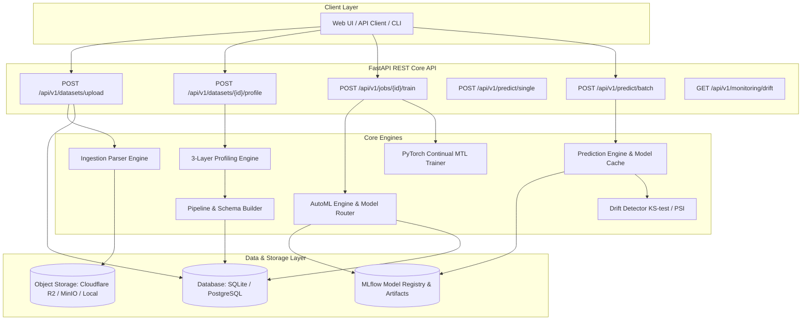
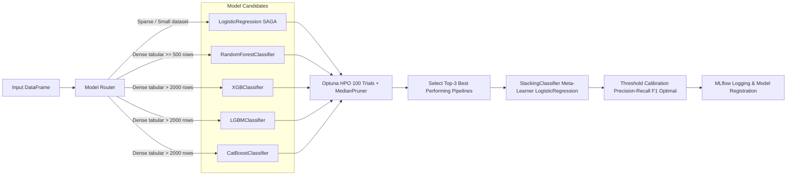

# Scalable Customer Data Platform (CDP) Architecture

This document presents the system architecture design, data flow pipelines, profiling heuristics, AutoML engine specifications, and model serving infrastructure of the Scalable Customer Data Platform (CDP).

---

## 1. High-Level System Architecture

The platform follows a clean, decoupled microservices-ready architecture centered around a FastAPI REST core, SQLAlchemy ORM (SQLite for local dev, PostgreSQL for production), object storage (Cloudflare R2 / MinIO / Local FS fallback), MLflow experiment tracking, and an Optuna-driven AutoML engine.

---

## 2. Core Modular Engines

### 2.1 Ingestion Layer (`backend/app/core/ingestion/`)
- Parses multi-format raw files (CSV, TSV, Parquet, JSON, ODS, Excel).
- Enforces strict file size validation (<50MB for synchronous REST upload).
- Handles custom delimiters (comma `,`, semicolon `;`, tab `\t`) and character encoding auto-detection.

### 2.2 Profiling Engine (`backend/app/core/profiler/`)
Calculates column-level statistical properties and applies heuristic rule matching:
- **Layer 1 (Statistical)**: Entropy, null percentage, cardinality, skewness, numeric range.
- **Layer 2 (Semantic Regex)**: Standard regex matchers infer semantic roles: `ID`, `TARGET`, `CATEGORICAL`, `NUMERIC`, `DATETIME`, `TEXT`.
- **Layer 3 (Target Leakage Detection)**: Flags columns exhibiting correlation $>0.95$ with target columns or containing post-event transaction tokens.
- **Target Synthesizer (CPI)**: Computes weighted or PCA-driven Customer Performance Index (CPI) composite scores for multi-task targets.

### 2.3 Preprocessing Pipeline & Schema Builder (`backend/app/core/pipeline/`)
Generates structural validation constraints automatically utilizing **Pandera schemas** and constructs scikit-learn `ColumnTransformer` pipelines:
- Numeric columns: Median Imputation + StandardScaler.
- Categorical columns: Constant Imputation + One-Hot Encoding (`handle_unknown='ignore'`).
- Text columns: TF-IDF Vectorization (`max_features=100`).
- Passthrough or drop rules for ID/ignored columns.

---

## 3. AutoML Training Engine (`backend/app/core/training/`)

The AutoML pipeline automatically routes, tunes, and ensembles models based on dataset characteristics.

### 3.1 Model Routing Heuristics (`model_router.py`)
- **Sparse / Small ($N < 1000$ or High Cardinality Text)**: `LogisticRegression` (SAGA solver, ElasticNet penalty).
- **Tabular Dense ($1000 \le N < 2000$)**: `RandomForestClassifier`.
- **Tabular Large ($N \ge 2000$)**: `XGBoost`, `LightGBM`, `CatBoost`, and `RandomForest` evaluated concurrently.

### 3.2 Hyperparameter Optimization (Optuna)
- **Search Budget**: Configurable via `OPTUNA_N_TRIALS` (default: 100) and `OPTUNA_TIMEOUT_SECONDS` (default: 3600s).
- **Early Pruning**: Uses `Optuna MedianPruner` (startup trials: 5, warmup steps: 2) to prematurely abort unpromising parameter trials.
- **Class Imbalance Auto-Detection**: Checks positive target class frequency. If churn rate $<25\%$ or $>75\%$, automatically injects `class_weight='balanced'` (or `auto_class_weights='Balanced'` for CatBoost).

### 3.3 Stacking Ensemble
When $\ge 2$ model candidates complete optimization, the engine collects the top-3 best single pipelines and wraps them into a `StackingClassifier` using a `LogisticRegression` meta-learner evaluated under 5-fold Stratified Cross-Validation.

---

## 4. Serving & Inference Engine (`backend/app/core/serving/`)

### 4.1 Model Cache
- **Thread-safe double-checked locking**: Avoids duplicate concurrent model loads from storage.
- **Time-to-Live (TTL)**: Cached models automatically invalidate after 10 minutes (configurable).

### 4.2 Batch Prediction Flow (`POST /api/v1/predict/batch`)
1. Fetches dataset file from storage via `dataset_id`.
2. Loads trained model pipeline and calibrated `optimal_threshold` from MLflow artifacts.
3. Computes prediction probabilities $P(\text{churn})$.
4. Applies `optimal_threshold` to classify binary outcome.
5. Maps risk tiers (`HIGH` risk if $P \ge \text{threshold}$, `MEDIUM` risk if $P \ge 0.5 \times \text{threshold}$, else `LOW`).

### 4.3 Data Drift Detection
- Computes **Kolmogorov-Smirnov (KS)** test statistics for continuous numerical features.
- Calculates **Population Stability Index (PSI)** for categorical feature distributions.
- Triggers auto-retrain background job when drift metric exceeds defined tolerance ($\text{PSI} > 0.25$).
