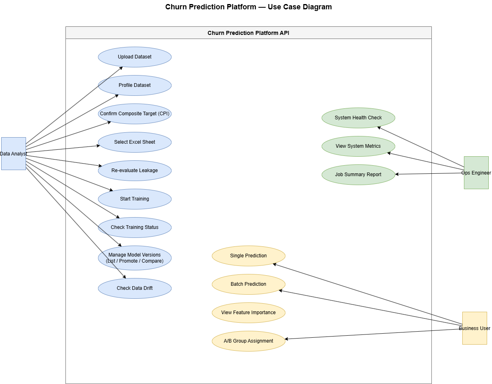
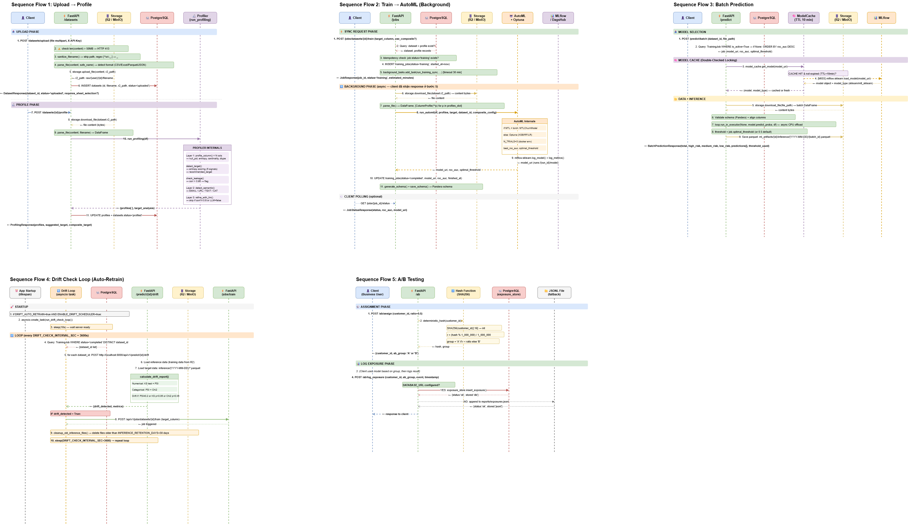

# Diagrams Index — Churn Prediction Platform

Thư mục này chứa toàn bộ hệ thống **13 sơ đồ** kiến trúc, luồng xử lý và thuật toán của hệ thống **Churn Prediction Platform** phục vụ cho việc phát triển, vận hành và viết báo cáo khoa học (scientific paper).

Ảnh được xuất từ draw.io và lưu tại `docs/img/`. XML để chỉnh sửa trong draw.io được đính kèm trong từng file chi tiết.

---

## 📂 Danh mục các Sơ đồ (13 Diagrams)

### 1. Kiến trúc Hệ thống & Triển khai → [system_and_component.md](system_and_component.md)

| Diagram | Preview |
|---|---|
| **Diagram 1: System Architecture** |  |
| **Diagram M4: Component Diagram** | .drawio.png) |
| **Diagram 6: Deployment Diagram** |  |

---

### 2. Hành vi & Tương tác → [use_cases_and_sequences.md](use_cases_and_sequences.md)

| Diagram | Preview |
|---|---|
| **Diagram 2: UseCase Diagram** |  |
| **Diagram 3: Sequence Diagrams** |  |
| **Diagram M2: State Machine Lifecycle** | .drawio.png) |

---

### 3. Thuật toán & Đường truyền Dữ liệu → [algorithms_and_pipelines.md](algorithms_and_pipelines.md)

| Diagram | Preview |
|---|---|
| **Diagram M1: ML Pipeline / Data Flow** |  |
| **Diagram 4: Algorithm Flowcharts** |  |
| **Diagram M5: CPI Synthesis Algorithm** |  |
| **Diagram M6: Continual Learning Loop** |  |

---

### 4. Cấu trúc Dữ liệu & Đánh giá mô hình → [database_and_evaluation.md](database_and_evaluation.md)

| Diagram | Preview |
|---|---|
| **Diagram 5: ER Diagram** |  |
| **Diagram M3: MTL Architecture** | %20Architecture.drawio.png) |
| **Diagram M7: Evaluation Framework** |  |

---

## 🗂️ Mapping Ảnh ↔ File Chi tiết

| File ảnh (`docs/img/`) | Sơ đồ | File chi tiết |
|---|---|---|
| `Architecture.drawio.png` | System Architecture | [system_and_component.md](system_and_component.md#1-diagram-1-system-architecture) |
| `Component Diagram (Module Dependencies).drawio.png` | Component Diagram | [system_and_component.md](system_and_component.md#2-diagram-m4-component-diagram) |
| `Deployment Diagram.drawio.png` | Deployment Diagram | [system_and_component.md](system_and_component.md#3-diagram-6-deployment-diagram) |
| `UseCase.drawio.png` | UseCase Diagram | [use_cases_and_sequences.md](use_cases_and_sequences.md#1-diagram-2-usecase-diagram) |
| `Sequence.drawio.png` | Sequence Diagrams | [use_cases_and_sequences.md](use_cases_and_sequences.md#2-diagram-3-sequence-diagrams-5-luồng-tương-tác-chính) |
| `Stage Machine(Entity Lifecircure).drawio.png` | State Machine | [use_cases_and_sequences.md](use_cases_and_sequences.md#3-diagram-m2-state-machine-lifecycle) |
| `ML Pipeline_ Dataflow.drawio.png` | ML Pipeline | [algorithms_and_pipelines.md](algorithms_and_pipelines.md#1-diagram-m1-ml-pipeline--data-flow) |
| `Algorithm Flowcharts.drawio.png` | Algorithm Flowcharts | [algorithms_and_pipelines.md](algorithms_and_pipelines.md#2-diagram-4-algorithm-flowcharts-3-thuật-toán-cốt-lõi) |
| `CPI Synthesis Algorithm.drawio.png` | CPI Synthesis | [algorithms_and_pipelines.md](algorithms_and_pipelines.md#3-diagram-m5-composite-target-synthesis-cpi-synthesis) |
| `Continual Learning Loop.drawio.png` | Continual Learning | [algorithms_and_pipelines.md](algorithms_and_pipelines.md#4-diagram-m6-continual-learning-loop) |
| `ER diagram.drawio.png` | ER Diagram | [database_and_evaluation.md](database_and_evaluation.md#1-diagram-5-entity-relationship-er-diagram) |
| `MTL (Multi-Task Learning) Architecture.drawio.png` | MTL Architecture | [database_and_evaluation.md](database_and_evaluation.md#2-diagram-m3-multi-task-learning-mtl-architecture) |
| `Evaluation Framework Diagram.drawio.png` | Evaluation Framework | [database_and_evaluation.md](database_and_evaluation.md#3-diagram-m7-evaluation-framework) |

---

## 🛠️ Hướng dẫn Chỉnh sửa (draw.io)

Mỗi sơ đồ đều được đính kèm mã **draw.io XML** trong các file chi tiết. Để chỉnh sửa trực quan:

1. Truy cập **[app.diagrams.net](https://app.diagrams.net/)** hoặc mở draw.io Desktop.
2. Chọn **Extras → Edit Diagram** (`Ctrl + Shift + X`).
3. Xóa sạch nội dung XML cũ, paste XML từ file tương ứng vào.
4. Nhấn **OK** để render.
5. Sau khi chỉnh sửa, export PNG và ghi đè file tương ứng trong `docs/img/`.
