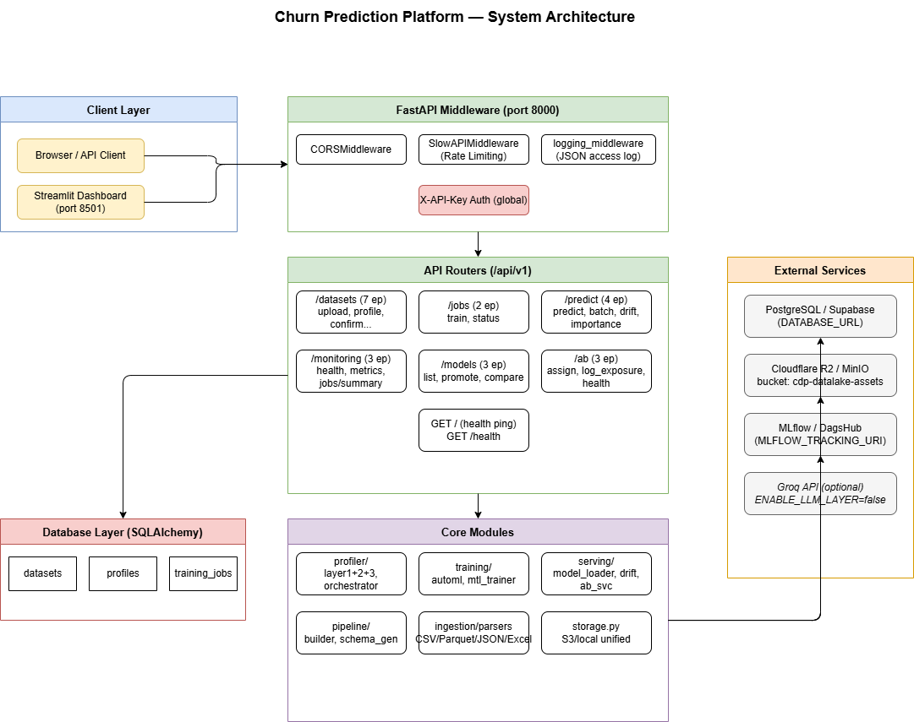

# Kiến trúc Hệ thống, Module & Triển khai

Tài liệu này chứa các sơ đồ liên quan đến kiến trúc tổng quan của dự án **Churn Prediction Platform**.

---

## 1. Diagram 1: System Architecture (Kiến trúc Hệ thống)

### Mô tả
Sơ đồ này mô tả cấu trúc phân tầng high-level của hệ thống bao gồm:
*   **Client Layer**: Streamlit Dashboard và các REST clients bên ngoài.
*   **API Gateway & Middleware**: Các lớp xử lý CORS, Rate Limiting (SlowAPI) và Log Middleware.
*   **API Routers**: 6 routers FastAPI đang active phục vụ cho các domain thực thể khác nhau.
*   **Core Modules**: Các module xử lý logic nghiệp vụ chính (profiler, training, serving).
*   **Database & External Services**: Kết nối đến PostgreSQL/Supabase, Cloudflare R2/MinIO, MLflow/DagsHub và Groq API.

### Preview


### draw.io XML
```xml
<mxGraphModel dx="1422" dy="762" grid="1" gridSize="10" guides="1" tooltips="1" connect="1" arrows="1" fold="1" page="1" pageScale="1" pageWidth="1654" pageHeight="1169" math="0" shadow="0">
  <root>
    <mxCell id="0"/>
    <mxCell id="1" parent="0"/>

    <!-- Title -->
    <mxCell id="title" value="Churn Prediction Platform — System Architecture" style="text;html=1;strokeColor=none;fillColor=none;align=center;verticalAlign=middle;whiteSpace=wrap;rounded=0;fontSize=18;fontStyle=1;" vertex="1" parent="1">
      <mxGeometry x="300" y="20" width="900" height="40" as="geometry"/>
    </mxCell>

    <!-- CLIENT LAYER -->
    <mxCell id="client_box" value="Client Layer" style="swimlane;startSize=30;fillColor=#dae8fc;strokeColor=#6c8ebf;fontSize=13;fontStyle=1;" vertex="1" parent="1">
      <mxGeometry x="40" y="80" width="280" height="160" as="geometry"/>
    </mxCell>
    <mxCell id="browser" value="Browser / API Client" style="rounded=1;whiteSpace=wrap;html=1;fillColor=#fff2cc;strokeColor=#d6b656;" vertex="1" parent="client_box">
      <mxGeometry x="20" y="50" width="150" height="40" as="geometry"/>
    </mxCell>
    <mxCell id="streamlit" value="Streamlit Dashboard&#xa;(port 8501)" style="rounded=1;whiteSpace=wrap;html=1;fillColor=#fff2cc;strokeColor=#d6b656;" vertex="1" parent="client_box">
      <mxGeometry x="20" y="105" width="150" height="40" as="geometry"/>
    </mxCell>

    <!-- API GATEWAY / MIDDLEWARE -->
    <mxCell id="middleware_box" value="FastAPI Middleware (port 8000)" style="swimlane;startSize=30;fillColor=#d5e8d4;strokeColor=#82b366;fontSize=13;fontStyle=1;" vertex="1" parent="1">
      <mxGeometry x="380" y="80" width="450" height="160" as="geometry"/>
    </mxCell>
    <mxCell id="cors" value="CORSMiddleware" style="rounded=1;whiteSpace=wrap;html=1;" vertex="1" parent="middleware_box">
      <mxGeometry x="10" y="45" width="130" height="35" as="geometry"/>
    </mxCell>
    <mxCell id="slowapi" value="SlowAPIMiddleware&#xa;(Rate Limiting)" style="rounded=1;whiteSpace=wrap;html=1;" vertex="1" parent="middleware_box">
      <mxGeometry x="155" y="45" width="130" height="35" as="geometry"/>
    </mxCell>
    <mxCell id="logmid" value="logging_middleware&#xa;(JSON access log)" style="rounded=1;whiteSpace=wrap;html=1;" vertex="1" parent="middleware_box">
      <mxGeometry x="300" y="45" width="135" height="35" as="geometry"/>
    </mxCell>
    <mxCell id="apikey" value="X-API-Key Auth (global)" style="rounded=1;whiteSpace=wrap;html=1;fillColor=#f8cecc;strokeColor=#b85450;" vertex="1" parent="middleware_box">
      <mxGeometry x="155" y="105" width="130" height="35" as="geometry"/>
    </mxCell>

    <!-- API ROUTERS -->
    <mxCell id="routers_box" value="API Routers (/api/v1)" style="swimlane;startSize=30;fillColor=#d5e8d4;strokeColor=#82b366;fontSize=13;fontStyle=1;" vertex="1" parent="1">
      <mxGeometry x="380" y="270" width="450" height="280" as="geometry"/>
    </mxCell>
    <mxCell id="r_datasets" value="/datasets (7 ep)&#xa;upload, profile, confirm..." style="rounded=1;whiteSpace=wrap;html=1;" vertex="1" parent="routers_box">
      <mxGeometry x="10" y="40" width="130" height="50" as="geometry"/>
    </mxCell>
    <mxCell id="r_jobs" value="/jobs (2 ep)&#xa;train, status" style="rounded=1;whiteSpace=wrap;html=1;" vertex="1" parent="routers_box">
      <mxGeometry x="155" y="40" width="130" height="50" as="geometry"/>
    </mxCell>
    <mxCell id="r_predict" value="/predict (4 ep)&#xa;predict, batch, drift, importance" style="rounded=1;whiteSpace=wrap;html=1;" vertex="1" parent="routers_box">
      <mxGeometry x="300" y="40" width="130" height="50" as="geometry"/>
    </mxCell>
    <mxCell id="r_monitoring" value="/monitoring (3 ep)&#xa;health, metrics, jobs/summary" style="rounded=1;whiteSpace=wrap;html=1;" vertex="1" parent="routers_box">
      <mxGeometry x="10" y="110" width="130" height="50" as="geometry"/>
    </mxCell>
    <mxCell id="r_models" value="/models (3 ep)&#xa;list, promote, compare" style="rounded=1;whiteSpace=wrap;html=1;" vertex="1" parent="routers_box">
      <mxGeometry x="155" y="110" width="130" height="50" as="geometry"/>
    </mxCell>
    <mxCell id="r_ab" value="/ab (3 ep)&#xa;assign, log_exposure, health" style="rounded=1;whiteSpace=wrap;html=1;" vertex="1" parent="routers_box">
      <mxGeometry x="300" y="110" width="130" height="50" as="geometry"/>
    </mxCell>
    <mxCell id="r_root" value="GET / (health ping)&#xa;GET /health" style="rounded=1;whiteSpace=wrap;html=1;" vertex="1" parent="routers_box">
      <mxGeometry x="155" y="180" width="130" height="50" as="geometry"/>
    </mxCell>

    <!-- CORE MODULES -->
    <mxCell id="core_box" value="Core Modules" style="swimlane;startSize=30;fillColor=#e1d5e7;strokeColor=#9673a6;fontSize=13;fontStyle=1;" vertex="1" parent="1">
      <mxGeometry x="380" y="580" width="450" height="240" as="geometry"/>
    </mxCell>
    <mxCell id="c_profiler" value="profiler/&#xa;layer1+2+3, orchestrator" style="rounded=1;whiteSpace=wrap;html=1;" vertex="1" parent="core_box">
      <mxGeometry x="10" y="40" width="130" height="50" as="geometry"/>
    </mxCell>
    <mxCell id="c_training" value="training/&#xa;automl, mtl_trainer" style="rounded=1;whiteSpace=wrap;html=1;" vertex="1" parent="core_box">
      <mxGeometry x="155" y="40" width="130" height="50" as="geometry"/>
    </mxCell>
    <mxCell id="c_serving" value="serving/&#xa;model_loader, drift, ab_svc" style="rounded=1;whiteSpace=wrap;html=1;" vertex="1" parent="core_box">
      <mxGeometry x="300" y="40" width="130" height="50" as="geometry"/>
    </mxCell>
    <mxCell id="c_pipeline" value="pipeline/&#xa;builder, schema_gen" style="rounded=1;whiteSpace=wrap;html=1;" vertex="1" parent="core_box">
      <mxGeometry x="10" y="110" width="130" height="50" as="geometry"/>
    </mxCell>
    <mxCell id="c_ingestion" value="ingestion/parsers&#xa;CSV/Parquet/JSON/Excel" style="rounded=1;whiteSpace=wrap;html=1;" vertex="1" parent="core_box">
      <mxGeometry x="155" y="110" width="130" height="50" as="geometry"/>
    </mxCell>
    <mxCell id="c_storage" value="storage.py&#xa;S3/local unified" style="rounded=1;whiteSpace=wrap;html=1;" vertex="1" parent="core_box">
      <mxGeometry x="300" y="110" width="130" height="50" as="geometry"/>
    </mxCell>

    <!-- EXTERNAL SERVICES -->
    <mxCell id="ext_box" value="External Services" style="swimlane;startSize=30;fillColor=#ffe6cc;strokeColor=#d79b00;fontSize=13;fontStyle=1;" vertex="1" parent="1">
      <mxGeometry x="900" y="270" width="220" height="380" as="geometry"/>
    </mxCell>
    <mxCell id="ext_pg" value="PostgreSQL / Supabase&#xa;(DATABASE_URL)" style="rounded=1;whiteSpace=wrap;html=1;fillColor=#f5f5f5;strokeColor=#666666;" vertex="1" parent="ext_box">
      <mxGeometry x="20" y="45" width="180" height="50" as="geometry"/>
    </mxCell>
    <mxCell id="ext_r2" value="Cloudflare R2 / MinIO&#xa;bucket: cdp-datalake-assets" style="rounded=1;whiteSpace=wrap;html=1;fillColor=#f5f5f5;strokeColor=#666666;" vertex="1" parent="ext_box">
      <mxGeometry x="20" y="115" width="180" height="50" as="geometry"/>
    </mxCell>
    <mxCell id="ext_mlflow" value="MLflow / DagsHub&#xa;(MLFLOW_TRACKING_URI)" style="rounded=1;whiteSpace=wrap;html=1;fillColor=#f5f5f5;strokeColor=#666666;" vertex="1" parent="ext_box">
      <mxGeometry x="20" y="185" width="180" height="50" as="geometry"/>
    </mxCell>
    <mxCell id="ext_groq" value="Groq API (optional)&#xa;ENABLE_LLM_LAYER=false" style="rounded=1;whiteSpace=wrap;html=1;fillColor=#f5f5f5;strokeColor=#666666;fontStyle=2;" vertex="1" parent="ext_box">
      <mxGeometry x="20" y="255" width="180" height="50" as="geometry"/>
    </mxCell>

    <!-- DB LAYER -->
    <mxCell id="db_box" value="Database Layer (SQLAlchemy)" style="swimlane;startSize=30;fillColor=#f8cecc;strokeColor=#b85450;fontSize=13;fontStyle=1;" vertex="1" parent="1">
      <mxGeometry x="40" y="580" width="290" height="120" as="geometry"/>
    </mxCell>
    <mxCell id="db_datasets" value="datasets" style="shape=table;html=1;" vertex="1" parent="db_box">
      <mxGeometry x="10" y="45" width="80" height="40" as="geometry"/>
    </mxCell>
    <mxCell id="db_profiles" value="profiles" style="shape=table;html=1;" vertex="1" parent="db_box">
      <mxGeometry x="105" y="45" width="80" height="40" as="geometry"/>
    </mxCell>
    <mxCell id="db_jobs" value="training_jobs" style="shape=table;html=1;" vertex="1" parent="db_box">
      <mxGeometry x="200" y="45" width="80" height="40" as="geometry"/>
    </mxCell>

    <!-- ARROWS -->
    <mxCell id="e1" style="edgeStyle=orthogonalEdgeStyle;" edge="1" source="browser" target="middleware_box" parent="1">
      <mxGeometry relative="1" as="geometry"/>
    </mxCell>
    <mxCell id="e2" style="edgeStyle=orthogonalEdgeStyle;" edge="1" source="streamlit" target="middleware_box" parent="1">
      <mxGeometry relative="1" as="geometry"/>
    </mxCell>
    <mxCell id="e3" style="edgeStyle=orthogonalEdgeStyle;" edge="1" source="middleware_box" target="routers_box" parent="1">
      <mxGeometry relative="1" as="geometry"/>
    </mxCell>
    <mxCell id="e4" style="edgeStyle=orthogonalEdgeStyle;" edge="1" source="routers_box" target="core_box" parent="1">
      <mxGeometry relative="1" as="geometry"/>
    </mxCell>
    <mxCell id="e5" style="edgeStyle=orthogonalEdgeStyle;" edge="1" source="core_box" target="ext_pg" parent="1">
      <mxGeometry relative="1" as="geometry"/>
    </mxCell>
    <mxCell id="e6" style="edgeStyle=orthogonalEdgeStyle;" edge="1" source="core_box" target="ext_r2" parent="1">
      <mxGeometry relative="1" as="geometry"/>
    </mxCell>
    <mxCell id="e7" style="edgeStyle=orthogonalEdgeStyle;" edge="1" source="core_box" target="ext_mlflow" parent="1">
      <mxGeometry relative="1" as="geometry"/>
    </mxCell>
    <mxCell id="e8" style="edgeStyle=orthogonalEdgeStyle;" edge="1" source="routers_box" target="db_box" parent="1">
      <mxGeometry relative="1" as="geometry"/>
    </mxCell>
  </root>
</mxGraphModel>
```

---

## 2. Diagram M4: Component Diagram (Sơ đồ các Thành phần)

### Mô tả
Component Diagram thể hiện mối quan hệ phụ thuộc lẫn nhau trực tiếp giữa các module mã nguồn `.py` trong codebase. Nó định hình cách các layer gọi nhau:
*   **API Layer** gọi các hàm điều phối từ `core/profiler/orchestrator.py` và `core/training/automl.py`.
*   Các module **Core** sử dụng thư viện tiện ích chung như `core/storage.py` (để tải/gửi file lên S3/R2) và `core/config.py` (cấu hình môi trường).
*   **Serving Layer** gọi ngược lại `jobs` router để tự động kích hoạt train lại mô hình khi phát hiện drift vượt ngưỡng.

### Preview
.drawio.png)

### draw.io XML
```xml
<mxGraphModel dx="1422" dy="762" grid="1" gridSize="10" guides="1" tooltips="1" connect="1" arrows="1" fold="1" page="1" pageScale="1" pageWidth="1654" pageHeight="827" math="0" shadow="0">
  <root>
    <mxCell id="0"/>
    <mxCell id="1" parent="0"/>

    <mxCell id="2" value="M4 — Component Diagram: Module Dependencies" style="text;html=1;strokeColor=none;fillColor=none;align=center;fontSize=20;fontStyle=1;" vertex="1" parent="1">
      <mxGeometry x="100" y="10" width="1400" height="36" as="geometry"/>
    </mxCell>

    <!-- ── API LAYER ── -->
    <mxCell id="10" value="API Layer (api/v1/)" style="swimlane;startSize=28;fillColor=#dae8fc;strokeColor=#6c8ebf;fontSize=13;fontStyle=1;" vertex="1" parent="1">
      <mxGeometry x="20" y="60" width="780" height="200" as="geometry"/>
    </mxCell>
    <mxCell id="11" value="datasets.py&#xa;POST /upload&#xa;POST/GET /profile&#xa;POST /confirm-composite" style="rounded=1;whiteSpace=wrap;html=1;fillColor=#dae8fc;strokeColor=#6c8ebf;fontSize=11;" vertex="1" parent="10">
      <mxGeometry x="15" y="40" width="160" height="80" as="geometry"/>
    </mxCell>
    <mxCell id="12" value="jobs.py&#xa;POST /datasets/{id}/train&#xa;GET /{id}/status" style="rounded=1;whiteSpace=wrap;html=1;fillColor=#dae8fc;strokeColor=#6c8ebf;fontSize=11;" vertex="1" parent="10">
      <mxGeometry x="190" y="40" width="150" height="80" as="geometry"/>
    </mxCell>
    <mxCell id="13" value="predict.py&#xa;POST /predict&#xa;POST /predict/batch&#xa;POST /predict/{id}/drift" style="rounded=1;whiteSpace=wrap;html=1;fillColor=#dae8fc;strokeColor=#6c8ebf;fontSize=11;" vertex="1" parent="10">
      <mxGeometry x="355" y="40" width="150" height="80" as="geometry"/>
    </mxCell>
    <mxCell id="14" value="models.py&#xa;GET /{id}/versions&#xa;POST /{id}/promote&#xa;GET /{id}/active" style="rounded=1;whiteSpace=wrap;html=1;fillColor=#dae8fc;strokeColor=#6c8ebf;fontSize=11;" vertex="1" parent="10">
      <mxGeometry x="520" y="40" width="140" height="80" as="geometry"/>
    </mxCell>
    <mxCell id="15" value="ab_service.py (router)&#xa;POST /ab/assign&#xa;POST /ab/log_exposure" style="rounded=1;whiteSpace=wrap;html=1;fillColor=#dae8fc;strokeColor=#6c8ebf;fontSize=11;" vertex="1" parent="10">
      <mxGeometry x="675" y="40" width="90" height="80" as="geometry"/>
    </mxCell>
    <mxCell id="16" value="monitoring.py&#xa;GET /monitoring/*" style="rounded=1;whiteSpace=wrap;html=1;fillColor=#dae8fc;strokeColor=#6c8ebf;fontSize=11;" vertex="1" parent="10">
      <mxGeometry x="15" y="140" width="130" height="48" as="geometry"/>
    </mxCell>
    <mxCell id="17" value="schemas.py (Pydantic)&#xa;ColumnProfile, JobStatus, BatchPrediction..." style="rounded=1;whiteSpace=wrap;html=1;fillColor=#e7f3ff;strokeColor=#6c8ebf;fontSize=11;" vertex="1" parent="10">
      <mxGeometry x="160" y="140" width="300" height="48" as="geometry"/>
    </mxCell>

    <!-- ── CORE/PROFILER ── -->
    <mxCell id="20" value="core/profiler/" style="swimlane;startSize=28;fillColor=#e1d5e7;strokeColor=#9673a6;fontSize=13;fontStyle=1;" vertex="1" parent="1">
      <mxGeometry x="20" y="290" width="500" height="200" as="geometry"/>
    </mxCell>
    <mxCell id="21" value="orchestrator.py&#xa;run_profiling()" style="rounded=1;whiteSpace=wrap;html=1;fillColor=#e1d5e7;strokeColor=#9673a6;fontSize=11;" vertex="1" parent="20">
      <mxGeometry x="15" y="40" width="130" height="50" as="geometry"/>
    </mxCell>
    <mxCell id="22" value="layer1_stats.py&#xa;profile_column()" style="rounded=1;whiteSpace=wrap;html=1;fillColor=#f3eaf7;strokeColor=#9673a6;fontSize=11;" vertex="1" parent="20">
      <mxGeometry x="160" y="40" width="120" height="50" as="geometry"/>
    </mxCell>
    <mxCell id="23" value="layer2_semantic.py&#xa;detect_semantic()" style="rounded=1;whiteSpace=wrap;html=1;fillColor=#f3eaf7;strokeColor=#9673a6;fontSize=11;" vertex="1" parent="20">
      <mxGeometry x="295" y="40" width="120" height="50" as="geometry"/>
    </mxCell>
    <mxCell id="24" value="layer3_llm.py&#xa;refine_with_llm()" style="rounded=1;whiteSpace=wrap;html=1;fillColor=#f5f5f5;strokeColor=#666666;fontSize=11;fontStyle=2;" vertex="1" parent="20">
      <mxGeometry x="365" y="40" width="120" height="50" as="geometry"/>
    </mxCell>
    <mxCell id="25" value="target_synthesizer.py&#xa;synthesize_target()&#xa;_pca/_weighted" style="rounded=1;whiteSpace=wrap;html=1;fillColor=#f3eaf7;strokeColor=#9673a6;fontSize=11;" vertex="1" parent="20">
      <mxGeometry x="15" y="110" width="130" height="60" as="geometry"/>
    </mxCell>
    <mxCell id="26" value="column_profile.py&#xa;ColumnProfile (Pydantic)" style="rounded=1;whiteSpace=wrap;html=1;fillColor=#f3eaf7;strokeColor=#9673a6;fontSize=11;" vertex="1" parent="20">
      <mxGeometry x="160" y="110" width="150" height="60" as="geometry"/>
    </mxCell>
    <mxCell id="27" value="target_analysis.py&#xa;TargetAnalysis, CompositeTargetConfig" style="rounded=1;whiteSpace=wrap;html=1;fillColor=#f3eaf7;strokeColor=#9673a6;fontSize=11;" vertex="1" parent="20">
      <mxGeometry x="320" y="110" width="165" height="60" as="geometry"/>
    </mxCell>
    <!-- Intra-profiler deps -->
    <mxCell id="500" style="edgeStyle=orthogonalEdgeStyle;dashed=1;strokeColor=#9673a6;" edge="1" source="21" target="22" parent="20"><mxGeometry relative="1" as="geometry"/></mxCell>
    <mxCell id="501" style="edgeStyle=orthogonalEdgeStyle;dashed=1;strokeColor=#9673a6;" edge="1" source="21" target="23" parent="20"><mxGeometry relative="1" as="geometry"/></mxCell>
    <mxCell id="502" style="edgeStyle=orthogonalEdgeStyle;dashed=1;strokeColor=#9673a6;" edge="1" source="21" target="25" parent="20"><mxGeometry relative="1" as="geometry"/></mxCell>

    <!-- ── CORE/TRAINING ── -->
    <mxCell id="30" value="core/training/" style="swimlane;startSize=28;fillColor=#ffe6cc;strokeColor=#d79b00;fontSize=13;fontStyle=1;" vertex="1" parent="1">
      <mxGeometry x="540" y="290" width="500" height="200" as="geometry"/>
    </mxCell>
    <mxCell id="31" value="automl.py&#xa;run_automl()" style="rounded=1;whiteSpace=wrap;html=1;fillColor=#ffe6cc;strokeColor=#d79b00;fontSize=11;fontStyle=1;" vertex="1" parent="30">
      <mxGeometry x="15" y="40" width="120" height="50" as="geometry"/>
    </mxCell>
    <mxCell id="32" value="model_router.py&#xa;route_models()" style="rounded=1;whiteSpace=wrap;html=1;fillColor=#fff3e0;strokeColor=#d79b00;fontSize=11;" vertex="1" parent="30">
      <mxGeometry x="150" y="40" width="120" height="50" as="geometry"/>
    </mxCell>
    <mxCell id="33" value="mtl_trainer.py&#xa;MTLChurnModel" style="rounded=1;whiteSpace=wrap;html=1;fillColor=#fff3e0;strokeColor=#d79b00;fontSize=11;" vertex="1" parent="30">
      <mxGeometry x="285" y="40" width="120" height="50" as="geometry"/>
    </mxCell>
    <mxCell id="34" value="continual_trainer.py&#xa;ContinualMTLTrainer" style="rounded=1;whiteSpace=wrap;html=1;fillColor=#fff3e0;strokeColor=#d79b00;fontSize=11;" vertex="1" parent="30">
      <mxGeometry x="15" y="120" width="140" height="50" as="geometry"/>
    </mxCell>
    <mxCell id="35" value="mlflow_utils.py&#xa;setup_mlflow()&#xa;cleanup_old_runs()" style="rounded=1;whiteSpace=wrap;html=1;fillColor=#fff3e0;strokeColor=#d79b00;fontSize=11;" vertex="1" parent="30">
      <mxGeometry x="170" y="120" width="130" height="50" as="geometry"/>
    </mxCell>
    <mxCell id="503" style="edgeStyle=orthogonalEdgeStyle;dashed=1;strokeColor=#d79b00;" edge="1" source="31" target="32" parent="30"><mxGeometry relative="1" as="geometry"/></mxCell>
    <mxCell id="504" style="edgeStyle=orthogonalEdgeStyle;dashed=1;strokeColor=#d79b00;" edge="1" source="31" target="33" parent="30"><mxGeometry relative="1" as="geometry"/></mxCell>
    <mxCell id="505" style="edgeStyle=orthogonalEdgeStyle;dashed=1;strokeColor=#d79b00;" edge="1" source="31" target="34" parent="30"><mxGeometry relative="1" as="geometry"/></mxCell>
    <mxCell id="506" style="edgeStyle=orthogonalEdgeStyle;dashed=1;strokeColor=#d79b00;" edge="1" source="31" target="35" parent="30"><mxGeometry relative="1" as="geometry"/></mxCell>

    <!-- ── CORE/PIPELINE ── -->
    <mxCell id="40" value="core/pipeline/" style="swimlane;startSize=28;fillColor=#d5e8d4;strokeColor=#82b366;fontSize=13;fontStyle=1;" vertex="1" parent="1">
      <mxGeometry x="20" y="520" width="380" height="160" as="geometry"/>
    </mxCell>
    <mxCell id="41" value="builder.py&#xa;build_pipeline()" style="rounded=1;whiteSpace=wrap;html=1;fillColor=#d5e8d4;strokeColor=#82b366;fontSize=11;fontStyle=1;" vertex="1" parent="40">
      <mxGeometry x="15" y="40" width="130" height="50" as="geometry"/>
    </mxCell>
    <mxCell id="42" value="schema_gen.py&#xa;generate_schema()" style="rounded=1;whiteSpace=wrap;html=1;fillColor=#eaf5ea;strokeColor=#82b366;fontSize=11;" vertex="1" parent="40">
      <mxGeometry x="160" y="40" width="130" height="50" as="geometry"/>
    </mxCell>
    <mxCell id="43" value="transforms/&#xa;imputers, encoders, date_parts" style="rounded=1;whiteSpace=wrap;html=1;fillColor=#eaf5ea;strokeColor=#82b366;fontSize=11;" vertex="1" parent="40">
      <mxGeometry x="15" y="105" width="275" height="44" as="geometry"/>
    </mxCell>
    <mxCell id="507" style="edgeStyle=orthogonalEdgeStyle;dashed=1;strokeColor=#82b366;" edge="1" source="41" target="43" parent="40"><mxGeometry relative="1" as="geometry"/></mxCell>

    <!-- ── CORE/SERVING ── -->
    <mxCell id="50" value="core/serving/" style="swimlane;startSize=28;fillColor=#f8cecc;strokeColor=#b85450;fontSize=13;fontStyle=1;" vertex="1" parent="1">
      <mxGeometry x="420" y="520" width="460" height="160" as="geometry"/>
    </mxCell>
    <mxCell id="51" value="model_loader.py&#xa;ModelCache (TTL=10min)" style="rounded=1;whiteSpace=wrap;html=1;fillColor=#f8cecc;strokeColor=#b85450;fontSize=11;" vertex="1" parent="50">
      <mxGeometry x="15" y="40" width="150" height="50" as="geometry"/>
    </mxCell>
    <mxCell id="52" value="drift_detector.py&#xa;calculate_drift_report()" style="rounded=1;whiteSpace=wrap;html=1;fillColor=#fef0ee;strokeColor=#b85450;fontSize=11;" vertex="1" parent="50">
      <mxGeometry x="180" y="40" width="150" height="50" as="geometry"/>
    </mxCell>
    <mxCell id="53" value="retrain_loop.py&#xa;run_drift_check_loop()" style="rounded=1;whiteSpace=wrap;html=1;fillColor=#fef0ee;strokeColor=#b85450;fontSize=11;" vertex="1" parent="50">
      <mxGeometry x="340" y="40" width="110" height="50" as="geometry"/>
    </mxCell>
    <mxCell id="54" value="ab_service.py&#xa;deterministic_hash()" style="rounded=1;whiteSpace=wrap;html=1;fillColor=#fef0ee;strokeColor=#b85450;fontSize=11;" vertex="1" parent="50">
      <mxGeometry x="15" y="105" width="130" height="44" as="geometry"/>
    </mxCell>

    <!-- ── SHARED INFRA ── -->
    <mxCell id="60" value="core/storage.py&#xa;upload_file(), download_file()&#xa;(R2 / MinIO / Local)" style="rounded=1;whiteSpace=wrap;html=1;fillColor=#fff2cc;strokeColor=#d6b656;fontSize=11;" vertex="1" parent="1">
      <mxGeometry x="900" y="520" width="200" height="70" as="geometry"/>
    </mxCell>
    <mxCell id="61" value="core/config.py&#xa;Settings (pydantic BaseSettings)&#xa;PSI_THRESHOLD, ENTROPY_*, N_TRIALS..." style="rounded=1;whiteSpace=wrap;html=1;fillColor=#f5f5f5;strokeColor=#666666;fontSize=11;" vertex="1" parent="1">
      <mxGeometry x="900" y="610" width="200" height="60" as="geometry"/>
    </mxCell>
    <mxCell id="62" value="db/models.py&#xa;Dataset, Profile,&#xa;TrainingJob, DriftReport" style="rounded=1;whiteSpace=wrap;html=1;fillColor=#f8cecc;strokeColor=#b85450;fontSize=11;" vertex="1" parent="1">
      <mxGeometry x="900" y="290" width="170" height="70" as="geometry"/>
    </mxCell>
    <mxCell id="63" value="core/ingestion/parsers.py&#xa;parse_file() → DataFrame" style="rounded=1;whiteSpace=wrap;html=1;fillColor=#dae8fc;strokeColor=#6c8ebf;fontSize=11;" vertex="1" parent="1">
      <mxGeometry x="900" y="380" width="170" height="60" as="geometry"/>
    </mxCell>

    <!-- ── CROSS-COMPONENT DEPENDENCY ARROWS ── -->
    <!-- datasets.py → profiler -->
    <mxCell id="600" value="uses" style="edgeStyle=orthogonalEdgeStyle;endArrow=open;dashed=1;strokeColor=#9673a6;strokeWidth=2;fontSize=10;" edge="1" source="11" target="21" parent="1"><mxGeometry relative="1" as="geometry"/></mxCell>
    <!-- datasets.py → parsers -->
    <mxCell id="601" value="uses" style="edgeStyle=orthogonalEdgeStyle;endArrow=open;dashed=1;strokeColor=#6c8ebf;fontSize=10;" edge="1" source="11" target="63" parent="1"><mxGeometry relative="1" as="geometry"/></mxCell>
    <!-- datasets.py → storage -->
    <mxCell id="602" value="uses" style="edgeStyle=orthogonalEdgeStyle;endArrow=open;dashed=1;strokeColor=#d6b656;fontSize=10;" edge="1" source="11" target="60" parent="1"><mxGeometry relative="1" as="geometry"/></mxCell>
    <!-- datasets.py → db -->
    <mxCell id="603" value="reads/writes" style="edgeStyle=orthogonalEdgeStyle;endArrow=open;dashed=1;strokeColor=#b85450;fontSize=10;" edge="1" source="11" target="62" parent="1"><mxGeometry relative="1" as="geometry"/></mxCell>
    <!-- jobs.py → automl -->
    <mxCell id="604" value="calls" style="edgeStyle=orthogonalEdgeStyle;endArrow=open;dashed=1;strokeColor=#d79b00;strokeWidth=2;fontSize=10;" edge="1" source="12" target="31" parent="1"><mxGeometry relative="1" as="geometry"/></mxCell>
    <!-- predict.py → model_loader -->
    <mxCell id="605" value="loads model" style="edgeStyle=orthogonalEdgeStyle;endArrow=open;dashed=1;strokeColor=#b85450;strokeWidth=2;fontSize=10;" edge="1" source="13" target="51" parent="1"><mxGeometry relative="1" as="geometry"/></mxCell>
    <!-- predict.py → drift_detector -->
    <mxCell id="606" value="calculates drift" style="edgeStyle=orthogonalEdgeStyle;endArrow=open;dashed=1;strokeColor=#b85450;fontSize=10;" edge="1" source="13" target="52" parent="1"><mxGeometry relative="1" as="geometry"/></mxCell>
    <!-- automl → builder -->
    <mxCell id="607" value="builds pipeline" style="edgeStyle=orthogonalEdgeStyle;endArrow=open;dashed=1;strokeColor=#82b366;strokeWidth=2;fontSize=10;" edge="1" source="31" target="41" parent="1"><mxGeometry relative="1" as="geometry"/></mxCell>
    <!-- automl → storage -->
    <mxCell id="608" value="downloads data" style="edgeStyle=orthogonalEdgeStyle;endArrow=open;dashed=1;strokeColor=#d6b656;fontSize=10;" edge="1" source="31" target="60" parent="1"><mxGeometry relative="1" as="geometry"/></mxCell>
    <!-- retrain_loop → jobs -->
    <mxCell id="609" value="triggers POST /train" style="edgeStyle=orthogonalEdgeStyle;endArrow=open;dashed=1;strokeColor=#b85450;strokeWidth=2;fontStyle=1;fontSize=10;" edge="1" source="53" target="12" parent="1"><mxGeometry relative="1" as="geometry"/></mxCell>
    <!-- models.py → db -->
    <mxCell id="610" value="reads/writes" style="edgeStyle=orthogonalEdgeStyle;endArrow=open;dashed=1;strokeColor=#b85450;fontSize=10;" edge="1" source="14" target="62" parent="1"><mxGeometry relative="1" as="geometry"/></mxCell>

  </root>
</mxGraphModel>
```

---

## 3. Diagram 6: Deployment Diagram (Mô hình Triển khai)

### Mô tả
Sơ đồ triển khai mô tả cách thức hệ thống chạy trên môi trường thực tế (Local & Production Cloud):
*   **Local Development** sử dụng Docker Compose để gom cụm 6 container (`db`, `minio`, `minio-init`, `mlflow`, `backend`, `analytics`). Mạng ảo nội bộ cho phép các container phân giải DNS theo tên service (ví dụ backend gọi S3 qua endpoint `http://minio:9000`).
*   **Production target**: Kiến trúc phân tán tối ưu chi phí:
    *   **Frontend (Next.js)** host trên Vercel.
    *   **Backend (FastAPI)** chạy trên Render.com (sử dụng Dockerfile multi-stage lớp `full` chạy Gunicorn).
    *   **PostgreSQL** host trên Supabase sử dụng Pgbouncer pooler.
    *   **Cloud Storage** lưu trữ assets dạng bảng dùng Cloudflare R2 (tương thích S3 API).
    *   **MLflow** lưu trữ vết mô hình và artifacts qua cổng tích hợp của DagsHub.

### Preview


### draw.io XML
```xml
<mxGraphModel dx="1422" dy="762" grid="1" gridSize="10" guides="1" tooltips="1" connect="1" arrows="1" fold="1" page="1" pageScale="1" pageWidth="1654" pageHeight="1169" math="0" shadow="0">
  <root>
    <mxCell id="0"/><mxCell id="1" parent="0"/>
    <mxCell id="t0" value="Deployment Diagram — Churn Prediction Platform" style="text;html=1;strokeColor=none;fillColor=none;align=center;fontSize=18;fontStyle=1;" vertex="1" parent="1">
      <mxGeometry x="300" y="10" width="900" height="30" as="geometry"/>
    </mxCell>

    <!-- LOCAL DEV BOX -->
    <mxCell id="local" value="Local Development (docker-compose)" style="swimlane;startSize=35;fillColor=#dae8fc;strokeColor=#6c8ebf;fontSize=14;fontStyle=1;" vertex="1" parent="1">
      <mxGeometry x="40" y="60" width="680" height="520" as="geometry"/>
    </mxCell>

    <mxCell id="svc_db" value="db&#xa;postgres:15-alpine&#xa;:5432&#xa;churn_platform_db" style="shape=mxgraph.network.server;fillColor=#f5f5f5;strokeColor=#666666;fontColor=#333333;fontSize=11;" vertex="1" parent="local">
      <mxGeometry x="30" y="60" width="140" height="100" as="geometry"/>
    </mxCell>

    <mxCell id="svc_minio" value="minio&#xa;minio/minio:latest&#xa;:9000 (API) :9001 (UI)&#xa;churn_platform_s3" style="shape=mxgraph.network.server;fillColor=#f5f5f5;strokeColor=#666666;fontColor=#333333;fontSize=11;" vertex="1" parent="local">
      <mxGeometry x="200" y="60" width="140" height="100" as="geometry"/>
    </mxCell>

    <mxCell id="svc_init" value="minio-init&#xa;minio/mc&#xa;(one-shot)&#xa;buckets: mlflow + cdp-datalake-assets" style="rounded=1;whiteSpace=wrap;html=1;fillColor=#f5f5f5;strokeColor=#666666;fontSize=10;" vertex="1" parent="local">
      <mxGeometry x="200" y="185" width="140" height="70" as="geometry"/>
    </mxCell>

    <mxCell id="svc_mlflow" value="mlflow&#xa;ghcr.io/mlflow/mlflow&#xa;:5000&#xa;churn_platform_mlflow&#xa;backend-store: postgres&#xa;artifact-root: s3://mlflow" style="shape=mxgraph.network.server;fillColor=#fff2cc;strokeColor=#d6b656;fontColor=#333333;fontSize=10;" vertex="1" parent="local">
      <mxGeometry x="370" y="60" width="140" height="120" as="geometry"/>
    </mxCell>

    <mxCell id="svc_api" value="backend&#xa;backend.Dockerfile (dev)&#xa;:8000&#xa;churn_platform_api&#xa;CMD: uvicorn app.main:app&#xa;USER: appuser (non-root)" style="shape=mxgraph.network.server;fillColor=#d5e8d4;strokeColor=#82b366;fontColor=#333333;fontSize=10;" vertex="1" parent="local">
      <mxGeometry x="30" y="280" width="160" height="130" as="geometry"/>
    </mxCell>

    <mxCell id="svc_analytics" value="analytics&#xa;analytics/Dockerfile&#xa;:8501&#xa;churn_platform_analytics&#xa;Streamlit Dashboard" style="shape=mxgraph.network.server;fillColor=#e1d5e7;strokeColor=#9673a6;fontColor=#333333;fontSize=10;" vertex="1" parent="local">
      <mxGeometry x="230" y="280" width="160" height="130" as="geometry"/>
    </mxCell>

    <mxCell id="vol1" value="Volume: postgres_data" style="shape=cylinder3;whiteSpace=wrap;html=1;fillColor=#f5f5f5;strokeColor=#666666;fontSize=10;" vertex="1" parent="local">
      <mxGeometry x="450" y="280" width="120" height="60" as="geometry"/>
    </mxCell>
    <mxCell id="vol2" value="Volume: minio_data" style="shape=cylinder3;whiteSpace=wrap;html=1;fillColor=#f5f5f5;strokeColor=#666666;fontSize=10;" vertex="1" parent="local">
      <mxGeometry x="450" y="360" width="120" height="60" as="geometry"/>
    </mxCell>

    <!-- PRODUCTION BOX -->
    <mxCell id="prod" value="Production (Cloud)" style="swimlane;startSize=35;fillColor=#ffe6cc;strokeColor=#d79b00;fontSize=14;fontStyle=1;" vertex="1" parent="1">
      <mxGeometry x="780" y="60" width="780" height="520" as="geometry"/>
    </mxCell>

    <mxCell id="prod_fe" value="Vercel&#xa;Next.js 14 Frontend&#xa;NEXT_PUBLIC_API_URL=...&#xa;[Scaffold ready, dev in progress]" style="rounded=1;whiteSpace=wrap;html=1;fillColor=#dae8fc;strokeColor=#6c8ebf;fontSize=11;" vertex="1" parent="prod">
      <mxGeometry x="30" y="60" width="200" height="90" as="geometry"/>
    </mxCell>

    <mxCell id="prod_be" value="Render.com&#xa;FastAPI Backend&#xa;Health: GET /health&#xa;Starter $7/mo&#xa;Gunicorn 4 workers&#xa;+ UvicornWorker (full stage)&#xa;USER: appuser (non-root)" style="rounded=1;whiteSpace=wrap;html=1;fillColor=#d5e8d4;strokeColor=#82b366;fontSize=11;" vertex="1" parent="prod">
      <mxGeometry x="250" y="60" width="200" height="130" as="geometry"/>
    </mxCell>

    <mxCell id="prod_db" value="Supabase&#xa;PostgreSQL&#xa;port 6543 (pooler)&#xa;pool_size=20, max_overflow=10&#xa;recycle=1800s, timeout=15s" style="rounded=1;whiteSpace=wrap;html=1;fillColor=#f8cecc;strokeColor=#b85450;fontSize=11;" vertex="1" parent="prod">
      <mxGeometry x="480" y="60" width="200" height="110" as="geometry"/>
    </mxCell>

    <mxCell id="prod_r2" value="Cloudflare R2&#xa;Object Storage&#xa;bucket: cdp-datalake-assets&#xa;path: raw/{user}/{dataset}/...&#xa;path: ml_artifacts/{id}/inference/..." style="rounded=1;whiteSpace=wrap;html=1;fillColor=#fff2cc;strokeColor=#d6b656;fontSize=11;" vertex="1" parent="prod">
      <mxGeometry x="30" y="200" width="200" height="110" as="geometry"/>
    </mxCell>

    <mxCell id="prod_mlflow" value="DagsHub&#xa;MLflow Tracking Server&#xa;MLFLOW_TRACKING_URI&#xa;artifact-root: S3/R2" style="rounded=1;whiteSpace=wrap;html=1;fillColor=#fff2cc;strokeColor=#d6b656;fontSize=11;" vertex="1" parent="prod">
      <mxGeometry x="250" y="200" width="200" height="90" as="geometry"/>
    </mxCell>

    <mxCell id="prod_groq" value="Groq API (optional)&#xa;ENABLE_LLM_LAYER=false&#xa;Layer 3 LLM refinement" style="rounded=1;whiteSpace=wrap;html=1;fillColor=#f5f5f5;strokeColor=#666666;fontSize=11;fontStyle=2;" vertex="1" parent="prod">
      <mxGeometry x="480" y="200" width="200" height="80" as="geometry"/>
    </mxCell>

    <!-- Dockerfile stages note -->
    <mxCell id="stages" value="backend.Dockerfile stages:&#xa;• base: python:3.11-slim (no torch)&#xa;• dev: uvicorn, non-root appuser&#xa;• full: +torch CPU, gunicorn 4w" style="text;html=1;align=left;fillColor=#f5f5f5;strokeColor=#666666;rounded=1;fontSize=10;" vertex="1" parent="prod">
      <mxGeometry x="30" y="360" width="280" height="90" as="geometry"/>
    </mxCell>

    <!-- Local internal arrows -->
    <mxCell style="edgeStyle=orthogonalEdgeStyle;" edge="1" source="svc_minio" target="svc_init" parent="local"><mxGeometry relative="1" as="geometry"/></mxCell>
    <mxCell style="edgeStyle=orthogonalEdgeStyle;" edge="1" source="svc_db" target="svc_mlflow" parent="local"><mxGeometry relative="1" as="geometry"/></mxCell>
    <mxCell style="edgeStyle=orthogonalEdgeStyle;" edge="1" source="svc_init" target="svc_mlflow" parent="local"><mxGeometry relative="1" as="geometry"/></mxCell>
    <mxCell style="edgeStyle=orthogonalEdgeStyle;" edge="1" source="svc_mlflow" target="svc_api" parent="local"><mxGeometry relative="1" as="geometry"/></mxCell>
    <mxCell style="edgeStyle=orthogonalEdgeStyle;" edge="1" source="svc_api" target="svc_analytics" parent="local"><mxGeometry relative="1" as="geometry"/></mxCell>
    <mxCell style="edgeStyle=orthogonalEdgeStyle;" edge="1" source="svc_db" target="vol1" parent="local"><mxGeometry relative="1" as="geometry"/></mxCell>
    <mxCell style="edgeStyle=orthogonalEdgeStyle;" edge="1" source="svc_minio" target="vol2" parent="local"><mxGeometry relative="1" as="geometry"/></mxCell>

    <!-- Production arrows -->
    <mxCell style="edgeStyle=orthogonalEdgeStyle;" edge="1" source="prod_fe" target="prod_be" parent="prod"><mxGeometry relative="1" as="geometry"/></mxCell>
    <mxCell style="edgeStyle=orthogonalEdgeStyle;" edge="1" source="prod_be" target="prod_db" parent="prod"><mxGeometry relative="1" as="geometry"/></mxCell>
  </root>
</mxGraphModel>
```
