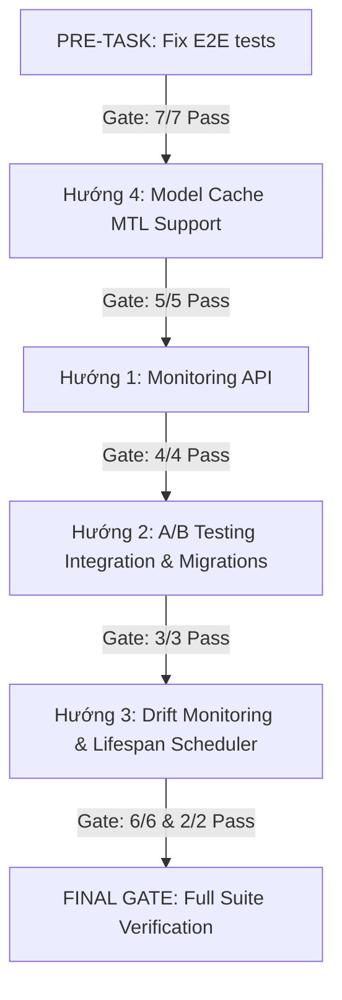

# Phase 3 Completion Plan

This document details the checklist, dependencies, and gates for completing all remaining Phase 3 operational tasks.

---

## Order of Operations



---

## 📋 Checklist

### PRE-TASK — Fix E2E test_06 + test_07

#### PRE-TASK A — Fix test_06_batch_predict
* **File**: `tests/e2e/test_phase3_e2e.py`
* **Step 1**: In `test_01_upload`, save the uploaded file path to state:
  ```python
  state["uploaded_file_path"] = data.get("r2_path") or data.get("file_path") or data.get("storage_path")
  ```
* **Step 2**: In `test_06_batch_predict`, replace hardcoded `file_path` with:
  ```python
  json={
      "dataset_id": state["dataset_id"],
      "file_path": state["uploaded_file_path"]
  }
  ```

#### PRE-TASK B — Fix test_07_re_evaluate_leakage
* **File 1**: `backend/app/api/schemas.py`
  Add the response schema:
  ```python
  class ReEvaluateLeakageResponse(BaseModel):
      profiles_updated_in_db: bool
      updated_profiles: List[ColumnProfile]
      dataset_id: str
      confirmed_target: str
      leakage_suspects: List[str] = []
  ```
* **File 2**: `backend/app/api/v1/datasets.py`
  Update endpoint `re-evaluate-leakage`:
  - Change `response_model` to `ReEvaluateLeakageResponse`.
  - Return:
    ```python
    return {
        "profiles_updated_in_db": True,
        "updated_profiles": updated_profiles,
        "dataset_id": dataset_id,
        "confirmed_target": request.confirmed_target,
        "leakage_suspects": [p.name for p in updated_profiles if p.potential_leakage]
    }
    ```
* **File 3**: `tests/e2e/test_phase3_e2e.py`
  Update `test_07_re_evaluate_leakage` assertions:
  ```python
  assert data.get("profiles_updated_in_db") is True
  assert "updated_profiles" in data
  assert len(data["updated_profiles"]) > 0
  assert isinstance(data["leakage_suspects"], list)
  ```

* **Gate**: 7/7 E2E tests pass -> Proceed to Hướng 4.

---

### HƯỚNG 4 — Model Cache MTL Support
* [ ] **Task 4.0**: Read and verify existing caching mechanism in `model_loader.py` and `mtl_trainer.py`.
* [ ] **Task 4.1**: Detect model type (sklearn vs PyTorch) using MLflow run tags or try-catch fallbacks during load.
* [ ] **Task 4.2**: Normalize `predict_proba()` output structure to `(n, 2)` shape using a prediction wrapper.
* [ ] **Task 4.3**: Add cache invalidation method `invalidate()` and invoke it upon training job completion.
* [ ] **Task 4.4**: Write unit tests verifying cache fallback, shape normalization, and cache clearing.
* [ ] **Gate**: 5/5 cache tests pass.

---

### HƯỚNG 1 — Monitoring API
* [ ] **Task 1.0**: Verify `StorageClient` methods and `TrainingJob` fields.
* [ ] **Task 1.1**: Add `ping()` connectivity and `list_files()` methods to `StorageClient`.
* [ ] **Task 1.2**: Implement `GET /monitoring/health` with multi-threaded pings and a strict 3.0s timeout limit.
* [ ] **Task 1.3**: Implement `GET /monitoring/metrics` containing aggregated job statuses and storage count.
* [ ] **Task 1.4**: Implement `GET /monitoring/jobs/summary` to group job metrics using `started_at` over 7 days.
* [ ] **Task 1.5**: Register monitoring router under `/api/v1` and implement unit tests.
* [ ] **Gate**: 4/4 monitoring tests pass.

---

### HƯỚNG 2 — A/B Testing Integration
* [ ] **Task 2.0**: Run `Get-ChildItem -r -filter "ab_service.py"` and verify its path before refactoring.
* [ ] **Task 2.0.5**: Verify if `TrainingJob` has `is_active` field. If not, add `is_active` boolean column and apply Alembic migration.
* [ ] **Task 2.1**: Refactor standalone FastAPI app in `ab_service.py` to use `APIRouter(prefix="/ab")`.
* [ ] **Task 2.2**: Ensure exposures database table is created.
* [ ] **Task 2.3**: Mount ab router in `main.py`.
* [ ] **Task 2.4**: Implement unit tests for variant assignment and logging exposure.
* [ ] **Gate**: 3/3 A/B testing tests pass.

---

### HƯỚNG 3 — Drift Monitoring + Auto-retrain
* [ ] **Task 3.0**: Read and verify current drift detector logic.
* [ ] **Task 3.0.5**: Capture and store batch prediction input data as parquet files under convention path: `ml_artifacts/{dataset_id}/inference/{YYYY-MM-DD}/{batch_id}.parquet`.
  * **Gate 3 Test**: Implement `tests/phase3/test_batch_predict_storage.py` containing `test_batch_predict_saves_inference_data` and `test_inference_data_correct_format` (2 tests).
* [ ] **Task 3.1**: Re-implement `calculate_psi` and `calculate_drift_report` in `drift_detector.py` with type inference and drift levels.
* [ ] **Task 3.2**: Refactor manual drift API `POST /datasets/{dataset_id}/drift` to return the new response schema and log reports in database.
* [ ] **Task 3.3**: Add `DRIFT_CHECK_INTERVAL_HOURS`, `DRIFT_AUTO_RETRAIN`, and `DRIFT_AUTO_RETRAIN_THRESHOLD` settings to configuration.
* [ ] **Task 3.4**: Implement `check_and_retrain_if_drift()` auto-retrain trigger fetching latest inference parquet files. Register periodic check loop in `main.py` using standard FastAPI `lifespan` manager.
* [ ] **Task 3.5**: Create and apply database migration for the `drift_reports` table.
* [ ] **Task 3.6**: Create unit tests for PSI calculations, drift report levels, and auto-retrain scheduling trigger.
* [ ] **Gate**: 6/6 drift tests and 2/2 storage tests pass.

---

## 🏁 Final Gate
* [ ] Run all Phase 3 tests and verify:
  * `tests/phase3/test_model_loader.py` (5/5)
  * `tests/phase3/test_monitoring_api.py` (4/4)
  * `tests/phase3/test_ab_api.py` (3/3)
  * `tests/phase3/test_drift_detector.py` (6/6)
  * `tests/phase3/test_batch_predict_storage.py` (2/2)
  * `tests/e2e/test_phase3_e2e.py` (7/7)
  * **TOTAL: 27/27 PASSED**
* [ ] Update `PROJECT_CONTEXT.md` to check all Phase 3 operational checklists.
